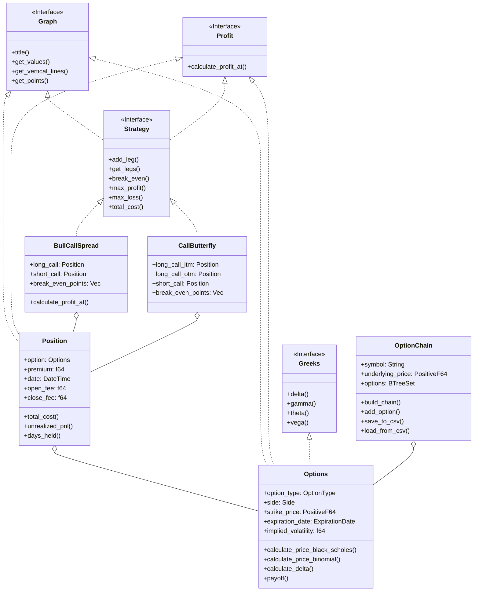

<div style="text-align: center;">
  
</div>

[](LICENSE)
[](https://crates.io/crates/optionstratlib)
[](https://crates.io/crates/optionstratlib)
[](https://github.com/joaquinbejar/OptionStratLib/stargazers)

[](https://github.com/joaquinbejar/OptionStratLib/actions)
[](https://codecov.io/gh/joaquinbejar/OptionStratLib)
[](https://libraries.io/github/joaquinbejar/OptionStratLib)

# OptionStratLib v0.2.0: Financial Options Library

## Table of Contents
1. [Introduction](#introduction)
2. [Features](#features)
3. [Project Structure](#project-structure)
4. [Setup Instructions](#setup-instructions)
5. [Library Usage](#library-usage)
6. [Usage Examples](#usage-examples)
7. [Testing](#testing)
8. [Contribution and Contact](#contribution-and-contact)

## Introduction

OptionStratLib is a comprehensive Rust library for options trading and strategy development across multiple asset classes. This versatile toolkit enables traders, quants, and developers to:

## Features

1. **Valuation Models**:
   - Black-Scholes model
   - Binomial model
   - Monte Carlo simulations
   - Telegraph process model

2. **Greeks Calculation**:
   - Delta, gamma, theta, vega, and rho
   - Custom Greeks implementation
   - Greeks visualization

3. **Option Types**:
   - European and American options
   - Calls and puts
   - Support for exotic options (Asian, Barrier, etc.)

4. **Volatility Models**:
   - Constant volatility
   - EWMA (Exponentially Weighted Moving Average)
   - GARCH implementation
   - Heston stochastic volatility
   - Volatility surface interpolation

5. **Option Chain Management**:
   - Chain construction and analysis
   - Strike price generation
   - Chain data import/export (CSV/JSON)

6. **Trading Strategies**:
   - Bull Call Spread
   - Bear Put Spread
   - Call Butterfly
   - Strategy optimization
   - Custom strategy development

7. **Risk Management**:
   - SPAN margin calculation
   - Position tracking
   - Break-even analysis
   - Profit/Loss calculations

8. **Simulation Tools**:
   - Random Walk simulation
   - Telegraph process
   - Monte Carlo methods
   - Custom simulation frameworks

9. **Visualization**:
   - Strategy payoff diagrams
   - Greeks visualization
   - Binomial trees
   - Risk profiles
   - Interactive charts

10. **Data Management**:
   - CSV/JSON import/export
   - Option chain data handling
   - Historical data analysis
   - Price series management

11. **Backtesting**: **TODO!**
12. **Performance Metrics**: **TODO!**


## Project Structure

The project is organized into the following key modules:

1. **Core Options** (`options/`):
   - `option.rs`: Core option structures and methods
   - `position.rs`: Position management
   - `chain.rs`: Option chain handling

2. **Pricing Models** (`pricing/`):
   - `binomial_model.rs`: Binomial tree implementation
   - `black_scholes_model.rs`: Black-Scholes pricing
   - `monte_carlo.rs`: Monte Carlo simulations
   - `telegraph.rs`: Telegraph process model

3. **Greeks** (`greeks/`):
   - `equations.rs`: Greeks calculations
   - `utils.rs`: Greek utilities

4. **Volatility** (`volatility/`):
   - `constant.rs`: Constant volatility model
   - `ewma.rs`: EWMA implementation
   - `garch.rs`: GARCH model
   - `heston.rs`: Heston model
   - `surface.rs`: Volatility surface handling

5. **Strategies** (`strategies/`):
   - `base.rs`: Strategy base traits
   - `bear_put_spread.rs`: 
   - `bull_call_spread.rs`: 
   - `butterfly_spread.rs`: 
   - `call_butterfly.rs`: 
   - `collar.rs`: 
   - `covered_call.rs`: 
   - `custom.rs`: Custom strategy framework
   - `iron_condor.rs`:
   - `poor_mans_covered_call.rs`: 
   - `protective_put.rs`: 
   - `straddle.rs`: 
   - `strangle.rs`: 
   - `utils.rs`: Strategy utilities

6. **Risk Management** (`risk/`):
   - `span.rs`: SPAN margin calculation
   - `margin.rs`: Margin requirements
   - `position.rs`: Position risk metrics

7. **Simulation** (`simulation/`):
   - `random_walk.rs`
   - `telegraph.rs`
   - `monte_carlo.rs`

8. **Visualization** (`visualization/`):
   - `binomial_tree.rs`
   - `strategy.rs`
   - `utils.rs`

9. **Data Management** (`data/`):
   - `chain.rs`: Chain data structures
   - `import.rs`: Data import utilities
   - `export.rs`: Data export utilities

## Relationships



## Setup Instructions

1. Clone the repository:
```shell
git clone https://github.com/joaquinbejar/OptionStratLib.git
cd OptionStratLib
```
   
2. Build the project:
```shell
make build
```

3. Run tests:
```shell
make test
```

4. Format the code:
```shell
make fmt
```

5. Run linting:
```shell
make lint
```

6. Clean the project:
```shell
make clean
```

7. Run the project:
```shell
make run
```

8. Fix issues:
```shell
make fix
 ```

9. Run pre-push checks:
```shell
make pre-push
```

10. Generate documentation:
```shell
make doc
```

11. Publish the package:
```shell
make publish
```

12. Generate coverage report:
```shell
make coverage
```


## Library Usage

To use the library in your project, add the following to your `Cargo.toml`:

```toml
[dependencies]
optionstratlib = { git = "https://github.com/joaquinbejar/OptionStratLib.git" }
```

## Usage Examples

Here are some examples of how to use the library for option pricing and analysis:

```rust
use optionstratlib::model::option::Options;
use optionstratlib::model::types::{ExpirationDate, OptionStyle, OptionType, Side};
use optionstratlib::visualization::utils::Graph;
use std::error::Error;
use optionstratlib::greeks::equations::Greeks;

fn create_sample_option() -> Options {
   Options::new(
      OptionType::European,
      Side::Short,
      "AAPL".to_string(),
      100.0,
      ExpirationDate::Days(30.0),
      0.2,
      1,
      105.0,
      0.05,
      OptionStyle::Call,
      0.0,
      None,
   )
}
fn main() -> Result<(), Box<dyn Error>> {
   let option = create_sample_option();
   info!("Title: {}", option.title());
   info!("Greeks: {:?}", option.greeks());

   // Define a range of prices for the graph
   let price_range: Vec<f64> = (50..150).map(|x| x as f64).collect();

   // Generate the intrinsic value graph
   option.graph(&price_range,
                "Draws/Options/intrinsic_value_chart.png",
                25,
                (1400, 933),
                (10, 30),
                10
   )?;

   Ok(())
}
```

```rust
use optionstratlib::model::types::ExpirationDate;
use optionstratlib::strategies::base::Strategies;
use optionstratlib::strategies::bull_call_spread::BullCallSpread;
use optionstratlib::visualization::utils::Graph;
use std::error::Error;

fn main() -> Result<(), Box<dyn Error>> {
   let strategy = BullCallSpread::new(
      "GOLD".to_string(),
      2505.8,
      2460.0,
      2515.0,
      ExpirationDate::Days(30.0),
      0.2,
      0.05,
      0.0,
      1,
      27.26,
      5.33,
      0.58,
      0.58,
      0.55,
      0.55,
   );
   let price_range: Vec<f64> = (2400..2600).map(|x| x as f64).collect();
   info!("Title: {}", strategy.title());
   info!("Break Even {}", strategy.break_even());
   info!("Net Premium Received: {}", strategy.net_premium_received());
   info!("Max Profit: {}", strategy.max_profit());
   info!("Max Loss: {}", strategy.max_loss());
   info!("Total Cost: {}", strategy.total_cost());

   // Generate the intrinsic value graph
   strategy.graph(
      &price_range,
      "Draws/Strategy/bull_call_spread_value_chart.png",
      20,
      (1400, 933),
      (10, 30),
      15
   )?;
   Ok(())
}
```

## Testing

To run unit tests:
```shell
make test
```

To run tests with coverage:
```shell
make coverage
```

## Contribution and Contact

We welcome contributions to this project! If you would like to contribute, please follow these steps:

1. Fork the repository.
2. Create a new branch for your feature or bug fix.
3. Make your changes and ensure that the project still builds and all tests pass.
4. Commit your changes and push your branch to your forked repository.
5. Submit a pull request to the main repository.

If you have any questions, issues, or would like to provide feedback, please feel free to contact the project maintainer:

**Joaquín Béjar García**
- Email: jb@taunais.com
- GitHub: [joaquinbejar](https://github.com/joaquinbejar)

We appreciate your interest and look forward to your contributions!
