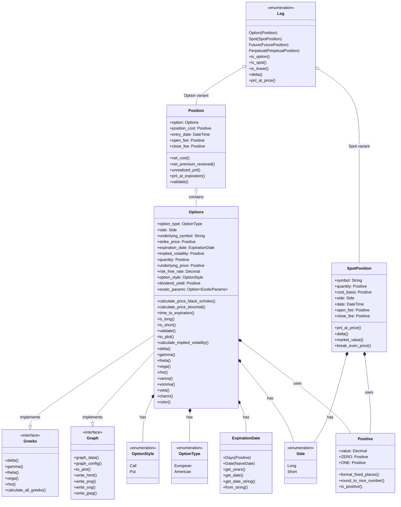

<div style="text-align: center;">

</div>

[](./LICENSE)
[](https://crates.io/crates/optionstratlib)
[](https://crates.io/crates/optionstratlib)
[](https://github.com/joaquinbejar/OptionStratLib/stargazers)
[](https://github.com/joaquinbejar/OptionStratLib/issues)
[](https://github.com/joaquinbejar/OptionStratLib/pulls)
[](https://github.com/joaquinbejar/OptionStratLib/actions)
[](https://codecov.io/gh/joaquinbejar/OptionStratLib)
[](https://libraries.io/github/joaquinbejar/OptionStratLib)
[](https://docs.rs/optionstratlib)
[](https://deepwiki.com/joaquinbejar/OptionStratLib)


## OptionStratLib v0.14.0: Financial Options Library

### Table of Contents
1. [Introduction](#introduction)
2. [Features](#features)
3. [Core Modules](#core-modules)
4. [Trading Strategies](#trading-strategies)
5. [Setup Instructions](#setup-instructions)
6. [Library Usage](#library-usage)
7. [Usage Examples](#usage-examples)
8. [Testing](#testing)
9. [Contribution and Contact](#contribution-and-contact)

### Introduction

OptionStratLib is a comprehensive Rust library for options trading and strategy development across multiple asset classes.
This versatile toolkit enables traders, quants, and developers to model, analyze, and visualize options strategies with a
robust, type-safe approach. The library focuses on precision with decimal-based calculations, extensive test coverage,
and a modular architecture built on modern Rust 2024 edition.

### Features

#### 1. **Pricing Models**
- **Black-Scholes Model**: European options pricing with full Greeks support
- **Binomial Tree Model**: American and European options with early exercise capability
- **Monte Carlo Simulations**: Complex pricing scenarios and path-dependent options
- **Telegraph Process Model**: Advanced stochastic modeling for jump-diffusion processes

#### 2. **Greeks Calculation**
- Complete Greeks suite: Delta, Gamma, Theta, Vega, Rho, Vanna, Vomma, Veta,
  Charm, Color
- Real-time sensitivity analysis
- Greeks visualization and risk profiling
- Custom Greeks implementations with adjustable parameters

#### 3. **Volatility Models**
- Implied volatility calculation using Newton-Raphson method
- Volatility surface construction and interpolation
- Historical volatility estimation
- Advanced volatility modeling tools

#### 4. **Option Chain Management**
- Complete option chain construction and analysis
- Strike price generation algorithms
- Chain data import/export (CSV/JSON formats)
- Advanced filtering and selection tools
- Option data grouping and organization

#### 5. **Trading Strategies (25+ Strategies)**
- **Single Leg**: Long/Short Calls and Puts
- **Spreads**: Bull/Bear Call/Put Spreads
- **Butterflies**: Long/Short Butterfly Spreads, Call Butterfly
- **Complex**: Iron Condor, Iron Butterfly
- **Volatility**: Long/Short Straddles and Strangles
- **Income**: Covered Calls (with spot leg support), Poor Man's Covered Call
- **Protection**: Protective Puts, Collars
- **Custom**: Flexible custom strategy framework
- **Multi-Asset**: Strategies combining options with spot, futures, or perpetuals

#### 6. **Risk Management & Analysis**
- Position tracking and management
- Break-even analysis with multiple break-even points
- Profit/Loss calculations at various price points
- Risk profiles and comprehensive visualizations
- Delta neutrality analysis and adjustment
- Probability analysis for strategy outcomes

#### 7. **Backtesting Framework**
- Comprehensive backtesting engine
- Performance metrics calculation
- Strategy optimization tools
- Historical analysis capabilities

#### 8. **Simulation Tools**
- Monte Carlo simulations for strategy testing
- Telegraph process implementation
- Random walk simulations
- Custom simulation frameworks
- Parametrized simulations with adjustable inputs

#### 9. **Visualization & Plotting**
- Strategy payoff diagrams
- Greeks visualization
- 3D volatility surfaces
- Risk profiles and P&L charts
- Interactive charts (powered by `plotly.rs`)
- Binomial tree visualization
- Comprehensive plotting utilities

#### 10. **Data Management**
- Efficient decimal-based calculations using `rust_decimal`
- CSV/JSON import/export functionality
- Time series data handling
- Price series management and manipulation
- Robust data validation and error handling

#### 11. **Mathematical Tools**
- Curve interpolation techniques
- Surface construction and analysis
- Geometric operations for financial modeling
- Advanced mathematical utilities for options pricing


### Core Modules

The library is organized into the following key modules:

#### **Model** (`model/`)
Core data structures and types for options trading:
- `option.rs`: Complete option structures with pricing and Greeks
- `position.rs`: Position management and P&L tracking
- `expiration.rs`: Flexible expiration date handling (Days/DateTime)
- `positive.rs`: Type-safe positive number implementation
- `types.rs`: Common enums (OptionType, Side, OptionStyle)
- `trade.rs`: Trade execution and management
- `format.rs`: Data formatting utilities
- **`leg/`**: Multi-instrument leg support for strategies
  - `traits.rs`: Common leg traits (`LegAble`, `Marginable`, `Fundable`, `Expirable`)
  - `spot.rs`: `SpotPosition` for underlying asset positions
  - `perpetual.rs`: `PerpetualPosition` for crypto perpetual swaps
  - `future.rs`: `FuturePosition` for exchange-traded futures
  - `leg_enum.rs`: `Leg` enum unifying all position types

#### **Pricing Models** (`pricing/`)
Advanced pricing engines for options valuation:
- `black_scholes_model.rs`: European options pricing with Greeks
- `binomial_model.rs`: American/European options with early exercise
- `monte_carlo.rs`: Path-dependent and exotic options pricing
- `telegraph.rs`: Jump-diffusion process modeling
- `payoff.rs`: Payoff function implementations

#### **Strategies** (`strategies/`)
Comprehensive trading strategy implementations:
- `base.rs`: Core traits (Strategable, BasicAble, Positionable, etc.)
- **Single Leg**: `long_call.rs`, `short_call.rs`, `long_put.rs`, `short_put.rs`
- **Spreads**: `bull_call_spread.rs`, `bear_call_spread.rs`, `bull_put_spread.rs`, `bear_put_spread.rs`
- **Butterflies**: `long_butterfly_spread.rs`, `short_butterfly_spread.rs`, `call_butterfly.rs`
- **Complex**: `iron_condor.rs`, `iron_butterfly.rs`
- **Volatility**: `long_straddle.rs`, `short_straddle.rs`, `long_strangle.rs`, `short_strangle.rs`
- **Income**: `covered_call.rs`, `poor_mans_covered_call.rs`
- **Protection**: `protective_put.rs`, `collar.rs`
- `custom.rs`: Flexible custom strategy framework
- `probabilities/`: Probability analysis for strategy outcomes
- `delta_neutral/`: Delta neutrality analysis and adjustment

#### **Volatility** (`volatility/`)
Volatility modeling and analysis:
- `utils.rs`: Implied volatility calculation (Newton-Raphson method)
- `traits.rs`: Volatility model interfaces
- Advanced volatility surface construction

#### **Greeks** (`greeks/`)
Complete Greeks calculation suite:
- Delta, Gamma, Theta, Vega, Rho, Vanna, Vomma, Veta, Charm, Color calculations
- Real-time sensitivity analysis
- Greeks-based risk management

#### **Chains** (`chains/`)
Option chain management and analysis:
- `chain.rs`: Option chain construction and manipulation
- `utils.rs`: Chain analysis and filtering tools
- CSV/JSON import/export functionality
- Strike price generation algorithms

#### **Backtesting** (`backtesting/`)
Strategy performance analysis:
- `metrics.rs`: Performance metrics calculation
- `results.rs`: Backtesting results management
- `types.rs`: Backtesting data structures

#### **Simulation** (`simulation/`)
Monte Carlo and stochastic simulations:
- Random walk implementations
- Telegraph process modeling
- Custom simulation frameworks
- Parametrized simulation tools

#### **Visualization** (`visualization/`)
Comprehensive plotting and charting:
- `plotly.rs`: Interactive charts with Plotly integration
- Strategy payoff diagrams
- Greeks visualization
- 3D volatility surfaces
- Risk profile charts

#### **Metrics** (`metrics/`)
Performance, risk, and liquidity metrics analysis:
- **Price Metrics**: Volatility skew curves
- **Risk Metrics**:
  - Implied Volatility curves (by strike) and surfaces (strike vs time)
  - Risk Reversal curves (by strike)
  - Dollar Gamma curves (by strike)
- **Composite Metrics**:
  - Vanna-Volga Hedge surfaces (price vs volatility)
  - Delta-Gamma Profile curves (by strike) and surfaces (price vs time)
  - Smile Dynamics curves (by strike) and surfaces (strike vs time)
- **Liquidity Metrics**:
  - Bid-Ask Spread curves (by strike)
  - Volume Profile curves (by strike) and surfaces (strike vs time)
  - Open Interest Distribution curves (by strike)
- **Stress Metrics**:
  - Volatility Sensitivity curves (by strike) and surfaces (price vs volatility)
  - Time Decay Profile curves (by strike) and surfaces (price vs time)
  - Price Shock Impact curves (by strike) and surfaces (price vs volatility)
- **Temporal Metrics**:
  - Theta curves (by strike) and surfaces (price vs time)
  - Charm (Delta Decay) curves (by strike) and surfaces (price vs time)
  - Color (Gamma Decay) curves (by strike) and surfaces (price vs time)

#### **Risk Management** (`risk/`)
Risk analysis and management tools:
- Position risk metrics
- Break-even analysis
- Risk profile generation

#### **P&L** (`pnl/`)
Profit and loss calculation:
- Real-time P&L tracking
- Historical P&L analysis
- Performance attribution

#### **Curves & Surfaces** (`curves/`, `surfaces/`)
Mathematical tools for financial modeling:
- Curve interpolation techniques
- Surface construction and analysis
- 3D visualization capabilities

#### **Error Handling** (`error/`)
Robust error management:
- Comprehensive error types for each module
- Type-safe error propagation
- Detailed error reporting

### Core Components



### Trading Strategies

OptionStratLib provides 25+ comprehensive trading strategies organized by complexity and market outlook:

#### **Single Leg Strategies**
Basic directional strategies for beginners:
- **Long Call**: Bullish strategy with unlimited upside potential
- **Short Call**: Bearish strategy collecting premium with limited profit
- **Long Put**: Bearish strategy with high profit potential
- **Short Put**: Bullish strategy collecting premium with assignment risk

#### **Spread Strategies**
Defined risk strategies with limited profit/loss:
- **Bull Call Spread**: Moderately bullish with limited risk and reward
- **Bear Call Spread**: Moderately bearish credit spread
- **Bull Put Spread**: Moderately bullish credit spread
- **Bear Put Spread**: Moderately bearish debit spread

#### **Butterfly Strategies**
Market neutral strategies profiting from low volatility:
- **Long Butterfly Spread**: Profits from price staying near middle strike
- **Short Butterfly Spread**: Profits from price moving away from middle strike
- **Call Butterfly**: Butterfly using only call options

#### **Complex Multi-Leg Strategies**
Advanced strategies for experienced traders:
- **Iron Condor**: Market neutral strategy with wide profit zone
- **Iron Butterfly**: Market neutral strategy with narrow profit zone

#### **Volatility Strategies**
Strategies that profit from volatility changes:
- **Long Straddle**: Profits from high volatility in either direction
- **Short Straddle**: Profits from low volatility (range-bound market)
- **Long Strangle**: Similar to straddle but with different strikes
- **Short Strangle**: Credit strategy profiting from low volatility

#### **Income Generation Strategies**
Strategies focused on generating regular income:
- **Covered Call**: Stock/spot ownership with call selling for income (now with full spot leg support)
- **Poor Man's Covered Call**: LEAPS-based covered call alternative

#### **Protection Strategies**
Risk management and hedging strategies:
- **Protective Put**: Downside protection for stock positions
- **Collar**: Combination of covered call and protective put

#### **Custom Strategy Framework**
- **Custom Strategy**: Flexible framework for creating any multi-leg strategy
- Supports unlimited number of legs
- Full integration with all analysis tools
- Complete trait implementation for consistency

#### **Strategy Analysis Features**
All strategies include comprehensive analysis capabilities:
- **Profit/Loss Analysis**: P&L at any price point and time
- **Break-Even Points**: Multiple break-even calculations
- **Greeks Analysis**: Real-time risk metrics
- **Probability Analysis**: Success probability calculations
- **Delta Neutrality**: Delta-neutral position analysis
- **Visualization**: Interactive payoff diagrams and risk profiles
- **Optimization**: Find optimal strikes and expirations

#### **Strategy Traits System**
All strategies implement a comprehensive trait system:

- **Strategable**: Master trait combining all strategy capabilities
- **BasicAble**: Basic strategy information (symbol, price, etc.)
- **Positionable**: Position management and modification
- **Strategies**: Core strategy calculations (P&L, break-even, etc.)
- **Validable**: Strategy validation and error checking
- **BreakEvenable**: Break-even point calculations
- **Profit**: Profit/loss analysis at various price points
- **Greeks**: Greeks calculations for risk management
- **DeltaNeutrality**: Delta-neutral analysis and adjustments
- **ProbabilityAnalysis**: Outcome probability calculations
- **Graph**: Visualization and plotting capabilities

### Setup Instructions

#### Prerequisites

- Rust 1.80 or higher (2024 edition)
- Cargo package manager

#### Installation

Add OptionStratLib to your `Cargo.toml`:

```toml
[dependencies]
optionstratlib = "0.6.1"
```

Or use cargo to add it to your project:

```bash
cargo add optionstratlib
```

#### Optional Features

The library includes optional features for enhanced functionality:

```toml
[dependencies]
optionstratlib = { version = "0.6.1", features = ["plotly"] }
```

- `plotly`: Enables interactive visualization using plotly.rs

#### Building from Source

Clone the repository and build using Cargo:

```bash
git clone https://github.com/joaquinbejar/OptionStratLib.git
cd OptionStratLib
cargo build --release
```

Run comprehensive test suite:

```bash
cargo test --all-features
```

Generate documentation:

```bash
cargo doc --open --all-features
```

Run benchmarks:

```bash
cargo bench
```

### Library Usage

#### Basic Option Creation and Pricing

```rust
use optionstratlib::{Options, OptionStyle, OptionType, Side, ExpirationDate};
use positive::{pos_or_panic,Positive};
use rust_decimal_macros::dec;
use optionstratlib::greeks::Greeks;

// Create a European call option
let option = Options::new(
    OptionType::European,
    Side::Long,
    "AAPL".to_string(),
    pos_or_panic!(150.0),            // strike_price
    ExpirationDate::Days(pos_or_panic!(30.0)),
    pos_or_panic!(0.25),             // implied_volatility
    Positive::ONE,              // quantity
    pos_or_panic!(155.0),            // underlying_price
    dec!(0.05),             // risk_free_rate
    OptionStyle::Call,
    pos_or_panic!(0.02),             // dividend_yield
    None,                   // exotic_params
);

// Calculate option price using Black-Scholes
let price = option.calculate_price_black_scholes().unwrap();
tracing::info!("Option price: ${:.2}", price);

// Calculate Greeks for risk management
let delta = option.delta().unwrap();
let gamma = option.gamma().unwrap();
let theta = option.theta().unwrap();
let vega = option.vega().unwrap();
let vanna = option.vanna().unwrap();
let vomma = option.vomma().unwrap();
let veta = option.veta().unwrap();
let charm = option.charm().unwrap();
let color = option.color().unwrap();
tracing::info!("Greeks - Delta: {:.4}, Gamma: {:.4}, Theta: {:.4},
    Vega: {:.4}, Vanna: {:.4}, Vomma: {:.4}, Veta: {:.4}
    Charm: {:.4}, Color: {:.4}",
    delta, gamma, theta, vega, vanna, vomma, veta, charm, color);
```

#### Working with Trading Strategies

```rust
use positive::{Positive, pos_or_panic};
use optionstratlib::ExpirationDate;
use optionstratlib::strategies::Strategies;
use optionstratlib::strategies::bull_call_spread::BullCallSpread;
use optionstratlib::strategies::base::{BreakEvenable, BasicAble};
use optionstratlib::visualization::Graph;
use rust_decimal_macros::dec;
use std::error::Error;

fn main() -> Result<(), Box<dyn Error>> {
    use optionstratlib::pricing::Profit;
let underlying_price = Positive::HUNDRED;

    // Create a Bull Call Spread strategy
    let strategy = BullCallSpread::new(
        "AAPL".to_string(),
        underlying_price,
        pos_or_panic!(95.0),   // long_strike
        pos_or_panic!(105.0),  // short_strike
        ExpirationDate::Days(pos_or_panic!(30.0)),
        pos_or_panic!(0.25),   // implied_volatility
        dec!(0.05),   // risk_free_rate
        pos_or_panic!(2.50),   // long_call_premium
        pos_or_panic!(2.50),   // long_call_open_fee
        pos_or_panic!(1.20),   // short_call_premium
        pos_or_panic!(1.20),   // short_call_close_fee
        Default::default(), Default::default(),
        Default::default(), Default::default()
    );

    // Analyze the strategy
    tracing::info!("Strategy: {}", strategy.get_title());
    tracing::info!("Break-even points: {:?}", strategy.get_break_even_points()?);
    tracing::info!("Max profit: ${:.2}", strategy.get_max_profit().unwrap_or(Positive::ZERO));
    tracing::info!("Max loss: ${:.2}", strategy.get_max_loss().unwrap_or(Positive::ZERO));
    tracing::info!("Net premium: ${:.2}", strategy.get_net_premium_received()?);

    // Calculate P&L at different price points
    let prices = vec![pos_or_panic!(90.0), pos_or_panic!(95.0), Positive::HUNDRED, pos_or_panic!(105.0), pos_or_panic!(110.0)];
    for price in prices {
        let pnl = strategy.get_point_at_price(&price)?;
        tracing::info!("P&L at ${}: ${:.2}", price, pnl.0);
    }

    // Generate visualization
    #[cfg(feature = "plotly")]
    {
        strategy.write_html("Draws/Visualization/bull_call_spread.html".as_ref())?;
    }

    Ok(())
}
```

#### Advanced Features: Volatility Analysis

```rust
use optionstratlib::prelude::*;

fn main() -> Result<(), Box<dyn std::error::Error>> {
    // Create an option for implied volatility calculation
    let mut option = Options::new(
        OptionType::European,
        Side::Long,
        "AAPL".to_string(),
        pos_or_panic!(105.0), // strike
        ExpirationDate::Days(pos_or_panic!(90.0)),
        pos_or_panic!(0.20), // initial IV guess
        Positive::ONE, // quantity
        Positive::HUNDRED, // underlying price
        dec!(0.05), // risk free rate
        OptionStyle::Call,
        pos_or_panic!(0.02), // dividend yield
        None,
    );

    let market_price = pos_or_panic!(5.50);
    let iv = implied_volatility(market_price, &mut option, 100)?;

    tracing::info!("Implied volatility: {:.2}%", iv.to_f64() * 100.0);
    Ok(())
}
```

#### Custom Strategy Creation

```rust
use optionstratlib::prelude::*;

// Define common parameters
let underlying_symbol = "DAX".to_string();
let underlying_price = pos_or_panic!(24000.0);
let expiration = ExpirationDate::Days(pos_or_panic!(30.0));
let implied_volatility = pos_or_panic!(0.25);
let risk_free_rate = dec!(0.05);
let dividend_yield = pos_or_panic!(0.02);
let fee = Positive::TWO;

// Create a long put option
let long_put_option = Options::new(
    OptionType::European,
    Side::Long,
    underlying_symbol.clone(),
    pos_or_panic!(24070.0), // strike
    expiration.clone(),
    implied_volatility,
    Positive::ONE, // quantity
    underlying_price,
    risk_free_rate,
    OptionStyle::Put,
    dividend_yield,
    None,
);
let long_put = Position::new(
    long_put_option,
    pos_or_panic!(150.0), // premium
    Utc::now(),
    fee,
    fee,
    None,
    None,
);

// Create a long call option
let long_call_option = Options::new(
    OptionType::European,
    Side::Long,
    underlying_symbol.clone(),
    pos_or_panic!(24030.0), // strike
    expiration.clone(),
    implied_volatility,
    Positive::ONE, // quantity
    underlying_price,
    risk_free_rate,
    OptionStyle::Call,
    dividend_yield,
    None,
);
let long_call = Position::new(
    long_call_option,
    pos_or_panic!(120.0), // premium
    Utc::now(),
    fee,
    fee,
    None,
    None,
);

// Create CustomStrategy with the positions
let positions = vec![long_call, long_put];
let strategy = CustomStrategy::new(
    "DAX Straddle Strategy".to_string(),
    underlying_symbol,
    "A DAX long straddle strategy".to_string(),
    underlying_price,
    positions,
    Positive::ONE,
    30,
    implied_volatility,
);

tracing::info!("Strategy created: {}", strategy.get_title());
```

### Testing

OptionStratLib includes a comprehensive test suite with over 1000 unit and integration tests:

#### **Running Tests**

Run all tests:
```bash
cargo test --all-features
```

Run tests for specific modules:
```bash
cargo test strategies::bull_call_spread
cargo test pricing::black_scholes
cargo test volatility::utils
```

Run tests with output:
```bash
cargo test -- --nocapture
```

#### **Test Categories**

- **Unit Tests**: Individual function and method testing
- **Integration Tests**: Cross-module functionality testing
- **Strategy Tests**: Comprehensive strategy validation
- **Pricing Model Tests**: Accuracy and performance testing
- **Greeks Tests**: Mathematical precision validation
- **Visualization Tests**: Chart generation and export testing

#### **Benchmarking**

Run performance benchmarks:
```bash
cargo bench
```

Generate test coverage report:
```bash
cargo tarpaulin --all-features --out Html
```

### Examples

The library includes extensive examples organized by functionality:

- **`examples/examples_strategies/`**: Complete strategy examples (25+ strategies)
- **`examples/examples_chains/`**: Option chain analysis examples
- **`examples/examples_pricing/`**: Pricing model demonstrations
- **`examples/examples_visualization/`**: Interactive chart examples
- **`examples/examples_volatility/`**: Volatility analysis examples
- **`examples/examples_simulation/`**: Monte Carlo and simulation examples

Run examples:
```bash
cargo run --example bull_call_spread --features plotly
cargo run --example black_scholes_pricing
cargo run --example volatility_surface
```

### Contribution and Contact

#### **Contributing**

Contributions are welcome! Please follow these guidelines:

1. **Fork** the repository
2. **Create** a feature branch: `git checkout -b feature/amazing-feature`
3. **Commit** your changes: `git commit -m 'Add amazing feature'`
4. **Push** to the branch: `git push origin feature/amazing-feature`
5. **Open** a Pull Request

#### **Development Setup**

```bash
git clone https://github.com/joaquinbejar/OptionStratLib.git
cd OptionStratLib
cargo build --all-features
cargo test --all-features
```

#### **Code Quality**

- All code must pass `cargo clippy` without warnings
- Format code with `cargo fmt`
- Add tests for new functionality
- Update documentation for API changes
- Follow Rust 2024 edition best practices


#### **Support**

- **Issues**: Report bugs and request features on GitHub
- **Discussions**: Join community discussions on GitHub Discussions
- **Documentation**: Comprehensive docs available at docs.rs

---

**OptionStratLib v0.7.0** - Built with ❤️ in Rust for the financial community


## Contribution and Contact

We welcome contributions to this project! If you would like to contribute, please follow these steps:

1. Fork the repository.
2. Create a new branch for your feature or bug fix.
3. Make your changes and ensure that the project still builds and all tests pass.
4. Commit your changes and push your branch to your forked repository.
5. Submit a pull request to the main repository.

If you have any questions, issues, or would like to provide feedback, please feel free to contact the project maintainer:


### **Contact Information**

- **Author**: Joaquín Béjar García
- **Email**: jb@taunais.com
- **Telegram**: [@joaquin_bejar](https://t.me/joaquin_bejar)
- **Repository**: <https://github.com/joaquinbejar/OptionStratLib>
- **Documentation**: <https://docs.rs/optionstratlib>

We appreciate your interest and look forward to your contributions!

## ✍️ License

Licensed under **MIT** license
